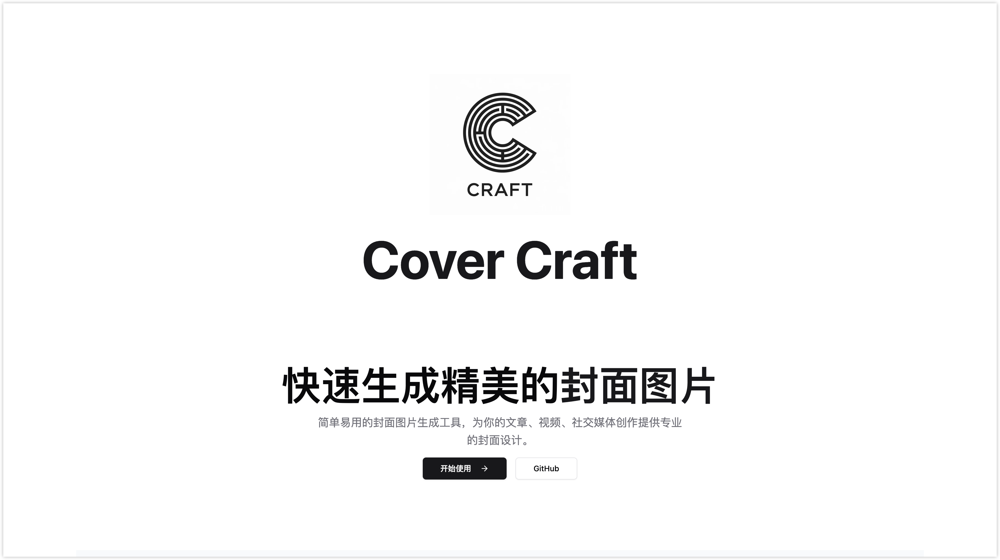
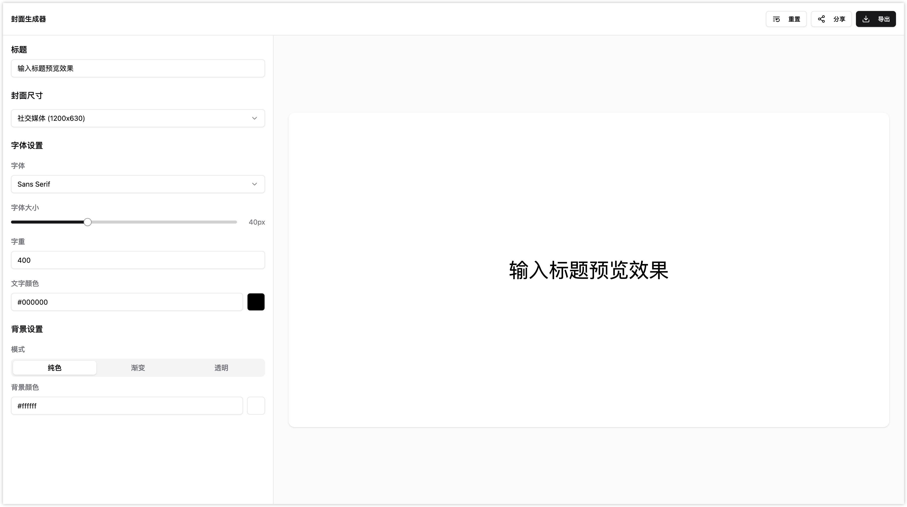

# 🎨 Cova

<div align="center">
  <p><strong>English</strong> | <a href="./README.zh-CN.md">简体中文</a></p>
  
  <picture>
    <source media="(prefers-color-scheme: dark)" srcset="public/logo.png">
    <source media="(prefers-color-scheme: light)" srcset="public/logo.png">
    
  </picture>

  <h1>Cova</h1>
  <p><strong>The new standard for cover design</strong></p>
  <p>Professional-grade cover design tool with real-time preview and instant export capabilities</p>

  <div>
    <a href="https://github.com/guizimo/cova/stargazers">
      
    </a>
    <a href="https://github.com/guizimo/cova/network/members">
      
    </a>
    <a href="https://github.com/guizimo/cova/blob/main/LICENSE">
      
    </a>
    <a href="https://github.com/guizimo/cova/releases">
      
    </a>
  </div>

  <br>

  <div>
    <a href="#-features">Features</a> •
    <a href="#-showcase">Showcase</a> •
    <a href="#-quick-start">Quick Start</a> •
    <a href="#-documentation">Documentation</a> •
    <a href="#-contributing">Contributing</a>
  </div>

  <br>

  <div>
    
    
    
    
  </div>
</div>

---

## 🌟 Features

<table>
  <tr>
    <td width="50%">
      <h3>🎨 Professional Design Tools</h3>
      <ul>
        <li><strong>Real-time Preview</strong> - See changes instantly as you design</li>
        <li><strong>Custom Typography</strong> - Fine-tune fonts, sizes, and styles</li>
        <li><strong>Advanced Layouts</strong> - Flexible positioning and alignment</li>
        <li><strong>Color Management</strong> - Gradients, solid colors, and transparency</li>
      </ul>
    </td>
    <td width="50%">
      <h3>⚡ Lightning Performance</h3>
      <ul>
        <li><strong>50ms Response Time</strong> - Blazing fast interactions</li>
        <li><strong>Local Processing</strong> - No server uploads, complete privacy</li>
        <li><strong>Memory Efficient</strong> - Optimized for large images</li>
        <li><strong>Cross-platform</strong> - Works on all modern browsers</li>
      </ul>
    </td>
  </tr>
  <tr>
    <td width="50%">
      <h3>🚀 Export & Share</h3>
      <ul>
        <li><strong>Multiple Formats</strong> - PNG, JPEG, WebP, AVIF support</li>
        <li><strong>Quality Control</strong> - Customizable compression settings</li>
        <li><strong>Batch Export</strong> - Export multiple variations</li>
        <li><strong>Social Ready</strong> - Optimized for all platforms</li>
      </ul>
    </td>
    <td width="50%">
      <h3>🌍 Global & Accessible</h3>
      <ul>
        <li><strong>Multi-language</strong> - English and Chinese support</li>
        <li><strong>Responsive Design</strong> - Perfect on desktop and mobile</li>
        <li><strong>Keyboard Shortcuts</strong> - Efficient workflow</li>
        <li><strong>Screen Reader</strong> - Fully accessible interface</li>
      </ul>
    </td>
  </tr>
</table>

## 📸 Showcase

<div align="center">
  
  **Modern Interface Design**
  <br>
  
  
  *Clean, intuitive interface designed for professional workflows*

  <br><br>

  **Powerful Export Capabilities**
  <br>
  
  
  *High-quality exports in multiple formats with customizable settings*

</div>

## 🚀 Quick Start

### Prerequisites

<div align="center">
  
  
</div>

### Installation

```bash
# Clone the repository
git clone https://github.com/guizimo/cova.git

# Navigate to the project directory
cd cova

# Install dependencies
pnpm install

# Start the development server
pnpm dev
```

### Docker (Alternative)

```bash
# Build and run with Docker
docker build -t cova .
docker run -p 3000:3000 cova
```

## 🏗️ Architecture

### Tech Stack

<div align="center">

| Category | Technologies |
|----------|-------------|
| **Frontend** |   |
| **Styling** |   |
| **Build Tools** |   |
| **State Management** |  |
| **Internationalization** |  |

</div>

### Project Structure

```
cova/
├── 📁 src/
│   ├── 📁 components/          # Reusable UI components
│   │   ├── 📁 ui/             # Base UI components (Button, Input, etc.)
│   │   ├── 📁 layout/         # Layout components (Navbar, Footer)
│   │   └── 📁 generator/      # Design tools components
│   ├── 📁 pages/              # Page components
│   │   ├── 📁 home/          # Landing page
│   │   ├── 📁 generator/     # Main editor
│   │   ├── 📁 features/      # Features showcase
│   │   ├── 📁 contact/       # Contact page
│   │   └── 📁 faq/           # FAQ page
│   ├── 📁 stores/            # Zustand stores
│   ├── 📁 hooks/             # Custom React hooks
│   ├── 📁 utils/             # Utility functions
│   ├── 📁 locales/           # i18n translations
│   └── 📁 router/            # Route configurations
├── 📁 public/                # Static assets
└── 📄 package.json          # Project configuration
```

## 📚 Documentation

### API Reference

<details>
<summary><strong>Core Components</strong></summary>

#### Generator Components
- `ConfigPanel` - Main configuration interface
- `Canvas` - Design canvas with real-time preview
- `ExportPanel` - Export controls and format selection

#### Configuration Options
- **Title**: Text content and typography settings
- **Background**: Colors, gradients, and image uploads
- **Layout**: Size presets and custom dimensions
- **Export**: Quality settings and format selection

</details>

<details>
<summary><strong>Customization Guide</strong></summary>

#### Adding Custom Fonts
```typescript
// Add to src/utils/fonts.ts
export const customFonts = [
  { name: 'Custom Font', value: 'custom-font' }
];
```

#### Custom Export Formats
```typescript
// Extend src/utils/export.ts
export const supportedFormats = ['png', 'jpeg', 'webp', 'avif'];
```

</details>

### Development Scripts

```bash
# Development
pnpm dev              # Start development server
pnpm build            # Build for production
pnpm preview          # Preview production build

# Code Quality
pnpm lint             # Run ESLint
pnpm format           # Format with Prettier
pnpm type-check       # TypeScript type checking

# Release
pnpm release          # Create new release
pnpm release:major    # Major version bump
pnpm release:minor    # Minor version bump
```

## 🤝 Contributing

We welcome contributions from the community! Here's how you can help:

### Development Workflow

1. **Fork** the repository
2. **Create** a feature branch: `git checkout -b feature/amazing-feature`
3. **Commit** your changes: `git commit -m 'feat: add amazing feature'`
4. **Push** to the branch: `git push origin feature/amazing-feature`
5. **Submit** a Pull Request

### Contribution Guidelines

<div align="center">

| Type | Description |
|------|-------------|
| 🐛 **Bug Reports** | Report issues with detailed reproduction steps |
| ✨ **Feature Requests** | Suggest new features with use cases |
| 📖 **Documentation** | Improve docs, add examples, fix typos |
| 🎨 **Design** | UI/UX improvements and design suggestions |
| 🔧 **Code** | Bug fixes, feature implementations, refactoring |

</div>

### Code Standards

- **TypeScript**: Fully typed codebase
- **ESLint**: Consistent code style
- **Prettier**: Automated formatting
- **Conventional Commits**: Semantic commit messages
- **Husky**: Pre-commit hooks for quality assurance

## 📊 Performance Metrics

<div align="center">

| Metric | Value | Description |
|--------|-------|-------------|
| **Response Time** | < 50ms | UI interaction responsiveness |
| **Bundle Size** | < 500KB | Optimized production build |
| **First Paint** | < 1s | Initial page load speed |
| **Core Web Vitals** | All Green | Google's UX metrics |

</div>

## 🌟 Roadmap

- [ ] **v1.0.0** - Stable release with core features
- [ ] **v1.1.0** - Template marketplace
- [ ] **v1.2.0** - Collaboration features
- [ ] **v1.3.0** - Plugin system
- [ ] **v2.0.0** - Advanced animations and effects

## 💝 Support

If you find Cova helpful, please consider:

<div align="center">
  <a href="https://github.com/guizimo/cova/stargazers">
    
  </a>
  <a href="https://github.com/guizimo/cova/issues">
    
  </a>
  <a href="https://github.com/guizimo/cova/discussions">
    
  </a>
</div>

## 📄 License

This project is licensed under the **GPL-3.0 License** - see the [LICENSE](LICENSE) file for details.

## 📞 Contact

<div align="center">

**Guizimo** - *Creator & Maintainer*

[](mailto:17680262548@163.com)
[](https://github.com/guizimo)

</div>

---

<div align="center">
  <strong>Made with ❤️ by the Cova Team</strong>
  <br>
  <sub>Built for creators, by creators</sub>
</div>
