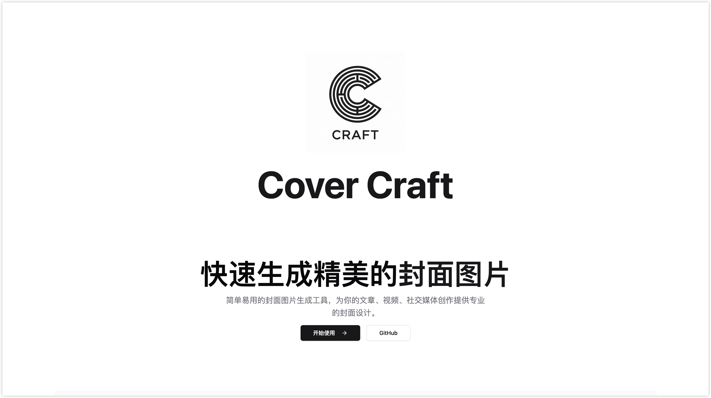
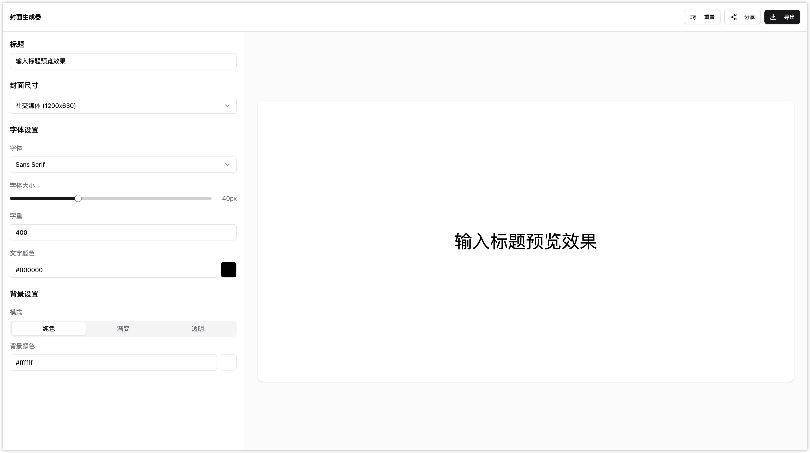

# 🎨 Cova

<div align="center">
  <p><a href="./README.md">English</a> | <strong>简体中文</strong></p>
  
  <picture>
    <source media="(prefers-color-scheme: dark)" srcset="public/logo.png">
    <source media="(prefers-color-scheme: light)" srcset="public/logo.png">
    
  </picture>

  <h1>Cova</h1>
  <p><strong>封面设计的全新标准</strong></p>
  <p>专业级封面设计工具，支持实时预览和即时导出功能</p>

  <div>
    <a href="https://github.com/guizimo/cova/stargazers">
      
    </a>
    <a href="https://github.com/guizimo/cova/network/members">
      
    </a>
    <a href="https://github.com/guizimo/cova/blob/main/LICENSE">
      
    </a>
    <a href="https://github.com/guizimo/cova/releases">
      
    </a>
  </div>

  <br>

  <div>
    <a href="#-功能特性">功能特性</a> •
    <a href="#-界面展示">界面展示</a> •
    <a href="#-快速开始">快速开始</a> •
    <a href="#-文档说明">文档说明</a> •
    <a href="#-参与贡献">参与贡献</a>
  </div>

  <br>

  <div>
    
    
    
    
  </div>
</div>

---

## 🌟 功能特性

<table>
  <tr>
    <td width="50%">
      <h3>🎨 专业设计工具</h3>
      <ul>
        <li><strong>实时预览</strong> - 即时查看设计效果</li>
        <li><strong>自定义排版</strong> - 精细调节字体、大小和样式</li>
        <li><strong>高级布局</strong> - 灵活的定位和对齐选项</li>
        <li><strong>色彩管理</strong> - 渐变、纯色和透明度控制</li>
      </ul>
    </td>
    <td width="50%">
      <h3>⚡ 闪电般性能</h3>
      <ul>
        <li><strong>50ms 响应时间</strong> - 极速交互体验</li>
        <li><strong>本地处理</strong> - 无需上传，完全保护隐私</li>
        <li><strong>内存优化</strong> - 针对大型图片优化</li>
        <li><strong>跨平台兼容</strong> - 支持所有现代浏览器</li>
      </ul>
    </td>
  </tr>
  <tr>
    <td width="50%">
      <h3>🚀 导出与分享</h3>
      <ul>
        <li><strong>多种格式</strong> - 支持 PNG、JPEG、WebP、AVIF</li>
        <li><strong>质量控制</strong> - 可自定义压缩设置</li>
        <li><strong>批量导出</strong> - 导出多个变体</li>
        <li><strong>社交媒体就绪</strong> - 针对各平台优化</li>
      </ul>
    </td>
    <td width="50%">
      <h3>🌍 全球化与无障碍</h3>
      <ul>
        <li><strong>多语言支持</strong> - 中英文界面切换</li>
        <li><strong>响应式设计</strong> - 完美适配桌面和移动端</li>
        <li><strong>键盘快捷键</strong> - 高效的工作流程</li>
        <li><strong>屏幕阅读器</strong> - 完全无障碍界面</li>
      </ul>
    </td>
  </tr>
</table>

## 📸 界面展示

<div align="center">
  
  **现代化界面设计**
  <br>
  
  
  *专为专业工作流程设计的简洁直观界面*

  <br><br>

  **强大的导出功能**
  <br>
  
  
  *支持多种格式的高质量导出，可自定义设置*

</div>

## 🚀 快速开始

### 环境要求

<div align="center">
  
  
</div>

### 安装步骤

```bash
# 克隆仓库
git clone https://github.com/guizimo/cova.git

# 进入项目目录
cd cova

# 安装依赖
pnpm install

# 启动开发服务器
pnpm dev
```

### Docker 部署（可选）

```bash
# 使用 Docker 构建和运行
docker build -t cova .
docker run -p 3000:3000 cova
```

## 🏗️ 技术架构

### 技术栈

<div align="center">

| 分类 | 技术 |
|----------|-------------|
| **前端框架** |   |
| **样式方案** |   |
| **构建工具** |   |
| **状态管理** |  |
| **国际化** |  |

</div>

### 项目结构

```
cova/
├── 📁 src/
│   ├── 📁 components/          # 可复用 UI 组件
│   │   ├── 📁 ui/             # 基础 UI 组件 (按钮、输入框等)
│   │   ├── 📁 layout/         # 布局组件 (导航栏、页脚)
│   │   └── 📁 generator/      # 设计工具组件
│   ├── 📁 pages/              # 页面组件
│   │   ├── 📁 home/          # 首页
│   │   ├── 📁 generator/     # 主编辑器
│   │   ├── 📁 features/      # 功能展示页
│   │   ├── 📁 contact/       # 联系页面
│   │   └── 📁 faq/           # 常见问题页
│   ├── 📁 stores/            # Zustand 状态管理
│   ├── 📁 hooks/             # 自定义 React Hooks
│   ├── 📁 utils/             # 工具函数
│   ├── 📁 locales/           # 国际化翻译文件
│   └── 📁 router/            # 路由配置
├── 📁 public/                # 静态资源
└── 📄 package.json          # 项目配置
```

## 📚 文档说明

### API 参考

<details>
<summary><strong>核心组件</strong></summary>

#### 生成器组件
- `ConfigPanel` - 主配置界面
- `Canvas` - 设计画布和实时预览
- `ExportPanel` - 导出控制和格式选择

#### 配置选项
- **标题**: 文本内容和排版设置
- **背景**: 颜色、渐变和图片上传
- **布局**: 尺寸预设和自定义尺寸
- **导出**: 质量设置和格式选择

</details>

<details>
<summary><strong>自定义指南</strong></summary>

#### 添加自定义字体
```typescript
// 在 src/utils/fonts.ts 中添加
export const customFonts = [
  { name: '自定义字体', value: 'custom-font' }
];
```

#### 自定义导出格式
```typescript
// 扩展 src/utils/export.ts
export const supportedFormats = ['png', 'jpeg', 'webp', 'avif'];
```

</details>

### 开发脚本

```bash
# 开发
pnpm dev              # 启动开发服务器
pnpm build            # 构建生产版本
pnpm preview          # 预览生产构建

# 代码质量
pnpm lint             # 运行 ESLint 检查
pnpm format           # 使用 Prettier 格式化
pnpm type-check       # TypeScript 类型检查

# 发布
pnpm release          # 创建新版本
pnpm release:major    # 主版本升级
pnpm release:minor    # 次版本升级
```

## 🤝 参与贡献

我们欢迎社区的贡献！以下是您可以参与的方式：

### 开发流程

1. **Fork** 仓库
2. **创建** 功能分支：`git checkout -b feature/amazing-feature`
3. **提交** 更改：`git commit -m 'feat: add amazing feature'`
4. **推送** 分支：`git push origin feature/amazing-feature`
5. **提交** Pull Request

### 贡献指南

<div align="center">

| 类型 | 描述 |
|------|-------------|
| 🐛 **错误报告** | 报告问题并提供详细的重现步骤 |
| ✨ **功能请求** | 提出新功能建议和使用场景 |
| 📖 **文档改进** | 改进文档、添加示例、修复错误 |
| 🎨 **设计** | UI/UX 改进和设计建议 |
| 🔧 **代码** | 错误修复、功能实现、重构 |

</div>

### 代码规范

- **TypeScript**: 完全类型化的代码库
- **ESLint**: 一致的代码风格
- **Prettier**: 自动格式化
- **约定式提交**: 语义化提交信息
- **Husky**: 提交前质量检查

## 📊 性能指标

<div align="center">

| 指标 | 数值 | 描述 |
|--------|-------|-------------|
| **响应时间** | < 50ms | UI 交互响应速度 |
| **包大小** | < 500KB | 优化后的生产构建 |
| **首次绘制** | < 1s | 初始页面加载速度 |
| **Core Web Vitals** | 全部优秀 | Google 用户体验指标 |

</div>

## 🌟 发展路线

- [ ] **v1.0.0** - 稳定版本和核心功能
- [ ] **v1.1.0** - 模板市场
- [ ] **v1.2.0** - 协作功能
- [ ] **v1.3.0** - 插件系统
- [ ] **v2.0.0** - 高级动画和特效

## 💝 支持项目

如果您觉得 Cova 有帮助，请考虑：

<div align="center">
  <a href="https://github.com/guizimo/cova/stargazers">
    
  </a>
  <a href="https://github.com/guizimo/cova/issues">
    
  </a>
  <a href="https://github.com/guizimo/cova/discussions">
    
  </a>
</div>

## 📄 开源协议

本项目基于 **GPL-3.0 协议** 开源 - 查看 [LICENSE](LICENSE) 文件了解详情。

## 📞 联系方式

<div align="center">

**Guizimo** - *创建者与维护者*

[](mailto:17680262548@163.com)
[](https://github.com/guizimo)

</div>

---

<div align="center">
  <strong>由 Cova 团队用 ❤️ 精心制作</strong>
  <br>
  <sub>为创作者而生，由创作者打造</sub>
</div>

        